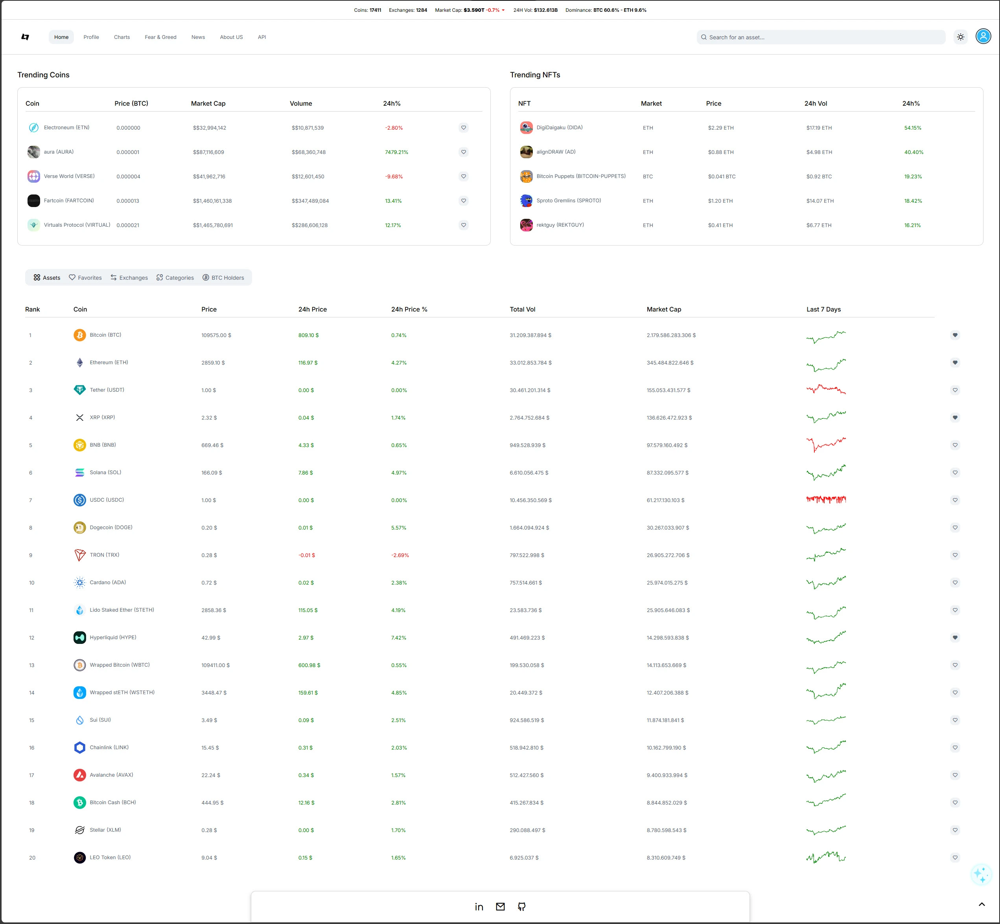

# CryptoWeb

[https://ai-iex.github.io/CryptoWeb/](https://ai-iex.github.io/CryptoWeb/)

**CryptoWeb** is a portfolio project showcasing backend development, API integration and a lightweight SPA front-end without heavy frameworks. It provides real-time crypto tracking, user management, market sentiment analysis and a simple chatbot demo.

> ⚠️ **Note:** All APIs used are free-tier services. They may have rate limits, slower updates or occasional endpoint changes.

---

## 📖 Description

CryptoWeb is a demonstration web app built to illustrate:

* Clean, scalable backend design with FastAPI
* Vanilla HTML/CSS/JavaScript front-end
* Integration with multiple free crypto market and sentiment APIs
* User authentication & role-based access
* AI ChatBot integrated with tools to help the user
* Interactive data visualizations

---

## 🚀 Implemented Features

1. **Authentication & Role Control**

   * User registration/login with JWT
   * Admin vs. regular user routes

2. **Crypto Tracking Dashboard**

   * Real-time price fetch of top cryptocurrencies
   * “Favorites” list per user

3. **Fear & Greed Index**

   * Current index display + color-coded circular gauge
   * Historical cards and interactive Chart.js line chart (7/30/90 days)

4. **Portfolio Management**

   * View and manage your personal crypto portfolio
   * Add, remove or adjust holdings

5. **Chatbot with Portfolio & Favorites Tools**

   * Conversational interface powered via Together.ai (MCP)
   * Chatbot can query your portfolio and favorite coins directly as built-in tools

6. **News Section**

   * Browse latest crypto news filtered by country or topic
   * Search and read articles from multiple news sites

7. **Auto-Generated API Docs**

   * Swagger UI at `/docs`

8. **Responsive Design & Theming**

   * Light/dark mode toggle
   * Mobile-friendly layouts

---

## 📸 Screenshots

**All screenshots are stored in `assets/screenshots`**

| Section                     | Image                                                           |
| --------------------------- | --------------------------------------------------------------- |
| Main Page (Light Mode)      |           |
| Search Results (Light Mode) |                        |
| Main Page (Dark Mode)       |                  |
| Coin Detail Page            |                     |
| Charts Widget               |                        |
| Portfolio Overview          |                  |
| Chatbot Favorites Tool      |  |
| Portfolio Tool              |        |
| Fear & Greed Index          |        |
| News Section                |                            |
| Signup Form                 |                        |
| About Us                    |                    |
---

## 🛠 Tech Stack

* **Frontend**: HTML5 · CSS3 · Vanilla JavaScript
* **Backend**: Python 3 · FastAPI · SQLAlchemy · PostgreSQL (or MySQL)
* **Auth**: JSON Web Tokens (JWT)
* **Charts**: Chart.js
* **Chatbot**: Together.ai with a free Model Context Protocol (MCP) integrated.
* **Deployment**: Backend: Docker · Front: Github Pages

---

## 🔗 Free APIs Used

* [Crypto Fear & Greed Index](https://alternative.me/crypto/fear-and-greed-index/)
* [CoinGecko API](https://www.coingecko.com)
* [Free News API](https://newsapi.org)
* [Free AI Models](https://www.together.ai/)

> ⚠️ Be aware of daily call limits and occasional endpoint changes.

---

## 📁 Repo Structure

```
CryptoWeb/
├─ backend/            # FastAPI application
│   ├─ AgenteIA/       # chatbot service and agent config
│   ├─ Api/            # api routes
│   ├─ Core/           # config (env reader) and security.py
│   ├─ db/             # db config files
│   ├─ Models/         # tables
│   ├─ Repositories/   # CRUD methods
│   ├─ Schemas/        # DTOs, data transfer objects
│   └─ Services/       # business logic
│   └─ main.py
├─ frontend/           # Static HTML/CSS/JS
│   ├─ index.html
│   ├─ pages/          # HTMLs
│   ├─ images/         
│   ├─ assets/
│   │   ├─ css/
│   │   └─ js/
├─ Dockerfile
└─ README.md
```

---

## 📌 Usage

1. Sign up or log in.
2. Browse real-time price data and add favorites.
3. View the current Fear & Greed Index and historical data.
4. Add your current portfolio and ask the chatbot how to improve it.
5. Explore API via Swagger UI.

---

## 💻 How to Run the Project Locally

1. Edit the `global.js` file and update the following constant with your backend URL:

```js
const API_BASE_URL = "http://localhost:8000";   // Replace with your actual backend URL
```

2. Create a `.env` file in the root of the backend project and add the following content:

```env
# Security configuration
SECRET_KEY = your_secret_key                     # Key for hash the passwords
ALGORITHM = your_algorithm                       # Algorithm for hash the passwords

# API Keys
TOGETHER_API_KEY = your_together_api_key         # Key for the chatbot (together.ai)
NEWS_API_KEY = your_news_api_key                 # Key for the news (newsapi.org)

# Admin credentials
ADMIN_USERNAME = admin_username                  # Default admin username
ADMIN_EMAIL = admin_email@example.com            # Default admin email
ADMIN_PASSWORD = your_admin_password             # Default admin password

# Database
DATABASE_URL = your_database_connection_string   # Your DB connection string
```

> ℹ️ These variables are accessed in the `Settings` class located at `Backend/Core/config.py`.

---

## 🤝 Contributions

This project is part of my personal portfolio. No pull requests are accepted, but feel free to fork and adapt for your own use.
